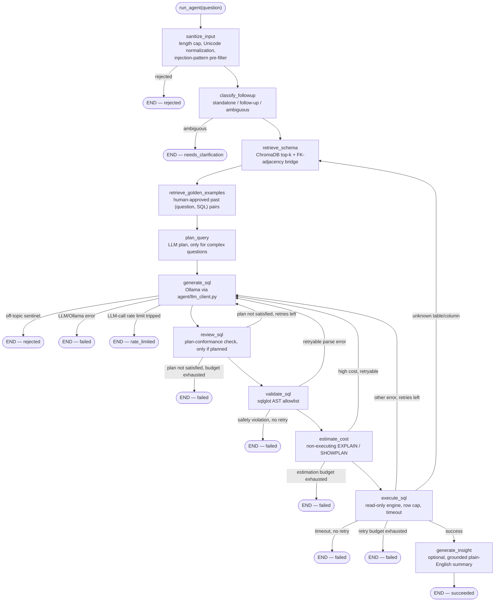

The agent is a compiled LangGraph `StateGraph` with eleven nodes — not a free-form chain or a ReAct loop. Every transition is a named conditional edge in `agent/graph.py::build_graph()`, which means every retry path, every terminal state, and every safety gate is explicitly enumerable from the code itself. State is threaded through all nodes as an `AgentState` TypedDict (`agent/state.py`, `total=False`): each node takes the current state and returns a **partial** dict of updates, which LangGraph merges into the running state. Two fields — `error_history` and `attempt_history` — use an `operator.add` reducer so each node's contribution **appends** rather than overwrites, giving `generate_sql` full visibility into every prior failure on a retry.

## Full graph flowchart

The Mermaid diagram below is the complete picture straight from the source — every node, every edge, every terminal state. Three failure shapes never loop back: a **safety violation**, an **LLM/Ollama error**, and a query **timeout**. Two additional terminal shapes are clean, expected stops rather than errors: `needs_clarification` (ambiguous follow-up) and `rate_limited` (process-wide LLM-call limiter tripped).

## The eleven nodes

<Accordion title="sanitize_input — the true entry point">
  Runs before anything else — before follow-up classification, before schema retrieval, before any LLM call — via `agent.input_guard.check_input`. Applies four checks in order:

  1. **Length cap** (`MAX_QUESTION_LENGTH`) — empty or over-length questions are rejected immediately.
  2. **Unicode normalization** — NFKC plus an explicit confusables-folding step that closes a homoglyph-substitution gap plain NFKC alone leaves open (`security/sanitization.py`).
  3. **Injection pre-filter** — a regex scan for common prompt-injection phrasings.
  4. **Off-topic / gibberish check** — a second, lighter filter before schema retrieval is spent on a question that's clearly not a database query.

  On rejection, `status` becomes `"rejected"` and `rejection_message` holds a standardized, non-technical message. The raw `rejection_reason` (`"too_long"`, `"empty"`, `"injection_detected"`, `"off_topic"`) is never shown to the user — no signal for an attacker to iterate against. The normalized question text overwrites `state["question"]`, so every downstream node operates on sanitized input.
</Accordion>

<Accordion title="classify_followup — cheap regex heuristic, no LLM call">
  A regex-only heuristic (`agent.followup.classify_followup`) that decides whether the sanitized question is **standalone**, a **follow-up** to the most recent prior exchange, or **ambiguous** — before any schema retrieval or LLM call. Cost is negligible relative to any Ollama round-trip.

  On `"ambiguous"`, the graph ends immediately with `status="needs_clarification"` rather than guessing. Standalone and follow-up questions both continue into `retrieve_schema`. For follow-up questions, `state["followup_resolved_against"]` holds the prior exchange the classification was resolved against — surfaced in the UI as "Following up on: …" so a wrong interpretation is visible before the user runs anything.
</Accordion>

<Accordion title="retrieve_schema — ChromaDB top-k + FK-bridge expansion">
  On the first pass, when more than one database is configured, calls `embeddings.retriever.select_database` to auto-route the question to one configured database and stores the result in `state["selected_database"]`. A single-database setup short-circuits this immediately.

  Then embeds the question, retrieves the top-`SCHEMA_TOP_K` most relevant tables from that database's own ChromaDB collection, and **expands** that set using FK-adjacency bridge expansion — a BFS over the full schema FK graph that finds and adds the shortest connecting path between disconnected "islands" of retrieved tables. This fixes the systematic blind spot where a fact table (mostly numeric columns) scores poorly against a text similarity search even though it is structurally required to answer the question.

  Table descriptions from `config/table_descriptions.yaml` are overlaid fresh from disk on every call — no cache, so a hand-edit takes effect on the very next question.

  This node is also the **re-entry point** on a `MISSING_REFERENCE` execution failure. When re-entering, the already-selected database is reused (never re-routed), `top_k` is widened by 2 (`settings.schema_top_k + 2`), and the database error text is folded into the retrieval query — the error usually names the missing identifier, which is genuinely useful signal for similarity search.
</Accordion>

<Accordion title="retrieve_golden_examples — few-shot pairs from human feedback">
  Looks up human-approved (question, SQL) pairs previously saved via the UI's thumbs-up feedback, from that database's own per-database ChromaDB collection (`embeddings/golden_examples.py`). Only runs when `ENABLE_GOLDEN_EXAMPLES` is on (default `true`), and only examples clearing `GOLDEN_EXAMPLES_MIN_SIMILARITY` (default 0.75) are kept.

  Matching examples are stored in `state["golden_examples"]` and injected into every subsequent `generate_sql` attempt's prompt as reference-only few-shot material. This node **fails open** in every edge case: a disabled flag, an empty or unreachable store, or a lookup error all resolve to "no examples" — never a reason a question can't be answered.
</Accordion>

<Accordion title="plan_query — agentic decomposition for complex questions only">
  The first half of the agentic query-planning pair. Reads `state["complexity_signals"]` (computed once, up front, by `run_agent()`) and, only when that list is non-empty **and** `ENABLE_QUERY_PLANNING` is on, makes one LLM call asking the model to break the question into a short ordered plan — grouping columns, metrics, filters, whether a top-N-per-group ranking needs a window function, whether a period-over-period comparison needs `LAG()`/`LEAD()`.

  The plan is stored in `state["query_plan"]` as a list of step strings and injected into every subsequent `generate_sql` attempt's prompt for this question.

  <Note>
    For an ordinary question that matches no complexity signal, `plan_query_node` returns immediately with `query_plan = None` — zero LLM calls, zero added latency, exactly as if this node were not in the graph at all. The same "non-trivial question" judgment that earns a question a wider retry budget also earns it these extra planning + review LLM calls.
  </Note>
</Accordion>

<Accordion title="generate_sql — Ollama call with full retry context">
  Checks the process-wide LLM-call rate limiter (`agent.rate_limit.get_llm_call_limiter`) before every attempt, including retries. A denial ends the run immediately at `status="rate_limited"` — never retried, since retrying immediately would just re-trip the same limiter.

  Otherwise calls Ollama (`agent/llm_client.py`) with:
  - The schema context from `retrieve_schema`
  - `state["query_plan"]` (if `plan_query_node` produced one), rendered as a numbered "implement every one of these steps" block — present on every retry, not just the first attempt
  - Golden-example few-shot pairs (if any cleared the similarity threshold)
  - On a retry: the previous SQL plus the specific error that came back, with a category-specific hint (e.g. "you referenced a column that doesn't exist, use only what's shown in the schema")

  Returns raw SQL text, not yet validated. The system prompt also instructs the model to refuse via a fixed sentinel if a question isn't answerable as SQL — a second, independent off-topic backstop that this node turns into the same `"rejected"` terminal state as `sanitize_input_node`'s pre-filter.
</Accordion>

<Accordion title="review_sql — plan-conformance check, only when a plan exists">
  The second half of the agentic query-planning pair. Only makes an LLM call when `state["query_plan"]` is a non-empty list — otherwise a zero-cost pass-through identical to `plan_query_node`'s own behavior. When there is a plan, one LLM call checks whether the just-generated SQL actually implements every step, returning a `PASS` / `FAIL: <reason>` verdict.

  A `FAIL` is treated exactly like any other retryable correctness mistake: the critique becomes this attempt's error feedback and the graph loops back to `generate_sql`, sharing the **same `retry_count` / `state["max_retries"]` budget** as every other retryable failure — not a separate, unbounded critique loop layered on top. Fails open on any review failure (unreachable Ollama, unparseable verdict): treated as a pass, since `validate_sql` and `execute_sql` are the real safety nets regardless.
</Accordion>

<Accordion title="validate_sql — sqlglot AST allowlist">
  Runs the candidate SQL through `agent/sql_validator.py`'s allowlist check, in the dialect matching `state["selected_database"]`'s own `DB_TYPE`. Allowlisted statement types are `SELECT`, `UNION`, `EXCEPT`, and `INTERSECT` only — an explicit allowlist, not a keyword blocklist that a syntax variant could slip past.

  **Safety violations** (non-SELECT, stacked queries, `SELECT ... INTO`, embedded writes inside CTEs, dangerous function calls) fail closed immediately — `END (failed)`, no retry, no budget consumed. This is a security gate, not a correctness mistake to coach through.

  An ordinary **parse mistake** or a statically-detectable `AVG(...SUM(...)...)` nested-aggregate shape increments `retry_count` and routes back to `generate_sql` if budget remains. A pass gets a `LIMIT` clause applied (`enforce_row_limit`) before moving to `estimate_cost`.
</Accordion>

<Accordion title="estimate_cost — non-executing EXPLAIN / SHOWPLAN">
  Runs a non-executing `EXPLAIN` / `SHOWPLAN` estimate on the validated SQL (`db/query_cost.py`) against the selected database's own engine and dialect. An earlier, additional layer in front of `execute_sql`'s existing timeout — not a replacement for it.

  Always **fails open**: any estimation problem (unsupported dialect, timeout, driver error) is logged and treated as "low cost, proceed." Severity levels:
  - **Low** — proceed silently.
  - **Moderate** — proceed, but set `cost_notice` so the UI can show "this may take a moment."
  - **High** — do not execute at all; treated as a retryable correctness mistake, sharing the same `max_retries` budget as a parse error, so the model gets a chance to add a filter before the agent gives up.
</Accordion>

<Accordion title="execute_sql — read-only engine, row cap, timeout">
  Runs the validated SQL against the selected database's own read-only engine. Row cap enforcement happens at two independent layers: a `LIMIT` clause added to the SQL text by `validate_sql_node`, and a `fetchmany(max_result_rows)` at the cursor level — so a malformed query that lacks a working `LIMIT` still can't pull an unbounded result set into memory.

  Timeout is enforced by running execution on a background thread and closing the socket from the calling thread if it's still running past `QUERY_TIMEOUT_SECONDS`. A session-level `SET` timeout is also applied first where the dialect supports it (Postgres/MySQL) as a belt-and-suspenders layer.

  Failures are classified by `agent/error_classification.py` into `TIMEOUT` / `MISSING_REFERENCE` / `AGGREGATE_NESTING` / `SYNTAX` / `UNKNOWN` and routed accordingly (see the retry table below).
</Accordion>

<Accordion title="generate_insight — grounded plain-English summary">
  Only reachable from `execute_sql_node`'s **success** path. Generates a short sentence about the result (`agent/insight.py::summarize_result`) — skipped entirely (no LLM call) when the UI's insight toggle is off, the result is empty, or the result is a single-cell value that a sentence would just restate.

  Before being shown, every number in the generated text is checked by `agent.insight.is_insight_grounded`: it must be traceable to the actual result data within a small rounding tolerance. An insight that fails this check is **dropped and never shown** — a tested hallucination guard (`tests/test_insight.py`), not just a prompt instruction. Nothing in this node can alter the already-final `sql`, `result_rows`, or `row_count`.
</Accordion>

## Retry semantics

Not every failure is treated the same way. The routing functions in `agent/nodes.py` distinguish failures by *what kind of mistake it was*, because "try again" is not equally useful for all of them.

| Failure category | Retries? | Routes to | Why |
|---|---|---|---|
| Input rejected (too long, empty, injection, off-topic) | **Never** | `END (rejected)` | The input itself is the problem — not a mistake to coach through. |
| Follow-up ambiguous | **Never** | `END (needs_clarification)` | Fail-closed on "I don't know what you're asking" rather than guessing. |
| Parse/empty SQL, or statically-detected `AVG(...SUM(...)...)` | Yes, up to `max_retries` | `generate_sql` | Ordinary correctness mistake — the model has the right context, just wrote bad SQL. |
| Safety violation (non-SELECT, stacked query, embedded write, dangerous function) | **Never** | `END (failed)` | Security gate — fails closed immediately regardless of remaining budget. |
| `generate_sql` off-topic sentinel | **Never** | `END (rejected)` | The model itself judged the question unanswerable as SQL. |
| `generate_sql` LLM/Ollama error | **Never** | `END (failed)` | Retrying the same call is unlikely to help within this run. |
| LLM-call rate limit tripped | **Never** | `END (rate_limited)` | Retrying immediately would re-trip the same limiter. |
| `review_sql` plan-conformance `FAIL` | Yes, up to `max_retries` | `generate_sql` | Treated as a correctness mistake; the reviewer's critique becomes the next attempt's error feedback. Shares the same budget. |
| Query cost estimate: high severity | Yes, up to `max_retries` | `generate_sql` | The model may be able to add a filter on its own. |
| Execution error: `SYNTAX` / `UNKNOWN` / `AGGREGATE_NESTING` | Yes, up to `max_retries` | `generate_sql` | Schema context was fine; the SQL text wasn't. |
| Execution error: `MISSING_REFERENCE` | Yes, up to `max_retries` | **`retrieve_schema`** | Wrong tables may have been retrieved — re-running generation with the same (possibly wrong) schema context would likely repeat the mistake. Re-entry widens `top_k` by 2 and folds the error text into the retrieval query. |
| Execution error: `TIMEOUT` | **Never** | `END (failed)` | Retrying an expensive query with the same shape wastes the entire retry budget. |

<Warning>
  `retry_count` is incremented inside the node itself (`review_sql_node`, `validate_sql_node`, `estimate_query_cost_node`, `execute_sql_node`) — not in the routing functions — so "retry vs. give up" is always decided from a single, freshly-incremented count. Every attempt appends exactly one `AttemptRecord` to `attempt_history` with `{attempt, sql, outcome, error, will_retry}` — this is what the dashboard's "Retry timeline" expander renders directly.
</Warning>

## Adaptive retry budgets

`state["max_retries"]` is not always `Settings.max_retries`. `run_agent()` calls `agent.complexity.compute_max_retries(question, base_max_retries, max_bonus)` once, up front, before the graph is invoked. The function uses a cheap, regex-only `detect_complexity_signals` heuristic (no LLM call) to flag a question as non-trivial if it matches one or more of four patterns:

- `top_n_per_group` — "top 3 products **per region**" (as opposed to a plain global top-N, which is not flagged)
- `growth_comparison` — "year-over-year," "compared to," "trend"
- `ranking_window` — "running total," "cumulative," "moving average"
- `multi_metric` — three or more distinct metric keywords (revenue, profit, count, distinct, …) in one question

Each matched signal earns one extra retry, capped at `COMPLEX_QUERY_MAX_RETRY_BONUS` (default 2). The same signals also gate `plan_query_node` and `review_sql_node` — so a plain question never pays for the extra planning LLM calls, and a complex question earns both a wider budget and the full decompose-then-check treatment.

## AgentState TypedDict structure

All node-to-node communication passes through `AgentState` (`agent/state.py`, `total=False`). Key fields:

| Field | Type | Set by | Purpose |
|---|---|---|---|
| `question` | `str` | Caller, overwritten by `sanitize_input` | The normalized question text all downstream nodes operate on. |
| `status` | `AgentStatus` | Each terminal node | One of `"pending"`, `"succeeded"`, `"failed"`, `"needs_clarification"`, `"rejected"`, `"rate_limited"`. |
| `sql` | `str \| None` | `generate_sql_node` | The most recent candidate SQL text. |
| `selected_database` | `str \| None` | `retrieve_schema_node` | Which configured database this question was auto-routed to. Never re-selected mid-run. |
| `query_plan` | `list[str] \| None` | `plan_query_node` | Ordered plan steps for complex questions; `None` for ordinary questions. |
| `golden_examples` | `list[GoldenExample] \| None` | `retrieve_golden_examples_node` | Best-matching human-approved (question, SQL) pairs above the similarity threshold. |
| `result_rows` | `list[tuple] \| None` | `execute_sql_node` | The actual query result rows, capped at `MAX_RESULT_ROWS`. |
| `retry_count` | `int` | `review_sql_node`, `validate_sql_node`, `estimate_query_cost_node`, `execute_sql_node` | Total retry attempts consumed so far for this question. |
| `max_retries` | `int` | Caller (via `compute_max_retries`) | This question's effective retry budget — may exceed `Settings.max_retries` for complex questions. |
| `complexity_signals` | `list[str]` | Caller | The `detect_complexity_signals` matches for this question. Carried on state for observability only. |
| `error_history` | `list[str]` (append-only) | Each failing node | Accumulates all raw error messages across every retry. Uses `operator.add` reducer — never overwritten. |
| `attempt_history` | `list[AttemptRecord]` (append-only) | Each node that concludes an attempt | One `{attempt, sql, outcome, error, will_retry}` record per concluded attempt. |
| `last_error_category` | `str \| None` | `validate_sql_node`, `execute_sql_node` | Most recent failure category — overwritten each attempt; used by `generate_sql_node` to pick a targeted retry hint. |
| `insight` | `str \| None` | `generate_insight_node` | Grounded plain-English summary, or `None` if skipped, disabled, or failed the groundedness check. |
| `cost_notice` | `str \| None` | `estimate_query_cost_node` | UI-facing "this may take a moment" notice, set only when cost severity is `"moderate"`. |
| `failure_explanation` | `str \| None` | The node that sets `status="failed"` | Plain-language, UI-ready summary of why the agent gave up. |
