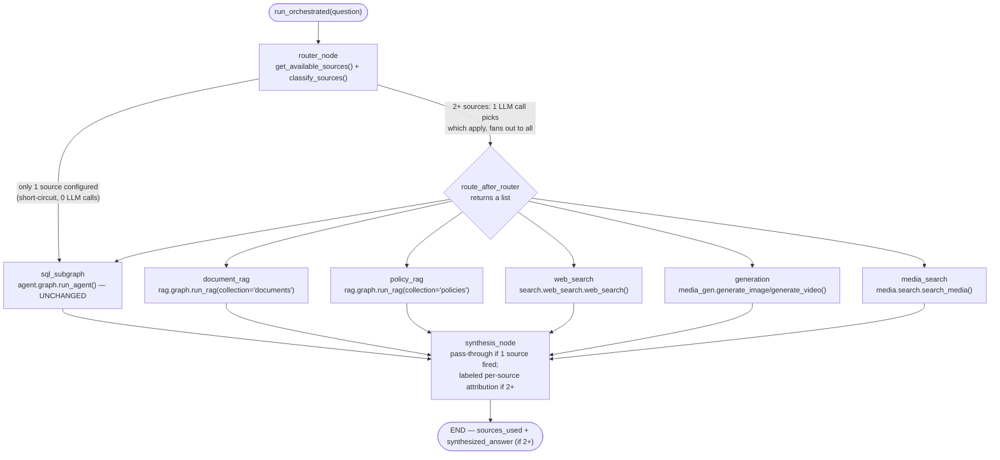

The multi-source orchestration layer is an optional wrapper around the SQL agent that can fan a single question out across several information sources in parallel and synthesize their contributions into one attributed answer. It is **off by default** (`ENABLE_MULTI_SOURCE_ROUTER=false`). When off, `agent.orchestrator.graph.run_orchestrated` — the single entry point `api/main.py` calls — is a pure pass-through to `agent.graph.run_agent`. The orchestrator graph is never even constructed, so the SQL pipeline in sections 1–3 of the architecture is exactly as accurate with the flag off as with it on. Turning the flag on with no additional sources configured changes nothing observable — the router sees only `sql` as available and short-circuits to it with zero added LLM calls.

## Architecture of the orchestrator



## Design principle: off by default, zero overhead when off

Every source is off by default. Each source has an `ENABLE_*` flag **and** a concrete config requirement (a connection string, an API key, a filesystem path). An enabled flag alone with nothing configured behind it is not "available" — routing to it would just fail. The `get_available_sources(settings)` function enforces this: it only includes a source when both conditions are met.

With one source available, `router_node` short-circuits immediately — no Chroma query, no LLM call, mirroring `embeddings.retriever.select_database`'s own single-database short-circuit. The SQL pipeline behavior is identical whether `ENABLE_MULTI_SOURCE_ROUTER` is `true` or `false` as long as only `sql` is available.

## The six source types

<CardGroup cols={2}>
  <Card title="sql" icon="database">
    **Always available.** `agent.graph.run_agent()` — the full 11-node self-correcting pipeline unchanged. Every `AgentState` field (`status`, `sql`, `result_rows`, `attempt_history`, …) is merged into `OrchestratorState` under the same keys, so every existing UI read site works identically whether a question went through `run_agent` directly or through the orchestrator.
  </Card>
  <Card title="documents" icon="file-pdf">
    **Requires:** `ENABLE_DOCUMENT_RAG=true` and `RAG_STORE_CONNECTION_STRING`. Agentic RAG over PDF uploads stored in SQL Server 2025+/Azure SQL native `VECTOR` columns. Includes relevance grading, automatic query rewriting on low-relevance retrieval (up to `RAG_MAX_RETRIES`), and per-claim `[filename]` citation.
  </Card>
  <Card title="policy" icon="shield-halved">
    **Requires:** `ENABLE_POLICY_RAG=true` and `RAG_STORE_CONNECTION_STRING`. Same RAG implementation as `documents` (`rag.graph.build_rag_subgraph(collection='policies')`), but with a hard sensitivity gate: chunks tagged `compensation`, `disciplinary`, or `legal` are **never** passed to the LLM — the node refuses before any generation call, regardless of who is asking.
  </Card>
  <Card title="web" icon="globe">
    **Requires:** `ENABLE_WEB_SEARCH=true` and `WEB_SEARCH_API_KEY`. Live web search via Tavily (the only implemented provider today). Every result answer always opens with "According to a live web search:" — never presented as if it came from the company's own systems. Results are wrapped in a fixed `WebResult` shape (`title`, `url`, `snippet`, `retrieved_at`) before they reach any prompt.
  </Card>
  <Card title="generation" icon="image">
    **Requires:** `ENABLE_MEDIA_GENERATION=true` and `IMA_API_KEY`. Image and video creation via IMA Studio. The **only source that spends real, metered money** — it never fires automatically. `generation_node` sets `status="pending_approval"` until a human clicks "▶ Generate image/video" in the dashboard or calls `POST /generate/confirm`. `Settings.require_generation_approval` defaults to `true`.
  </Card>
  <Card title="media_search" icon="photo-film">
    **Requires:** `ENABLE_MEDIA_SEARCH=true` and a real `MEDIA_LIBRARY_PATH`. Content-based search over a local, untagged image/video library using local CLIP embeddings (no API key, no per-item cost). Video segments are split at scene-change boundaries, transcribed with Whisper, OCR'd, and optionally captioned by a local Ollama vision model. Fully local by default — nothing about your library is sent anywhere.
  </Card>
</CardGroup>

## Router: availability, then classification

The routing decision happens in two steps, separated so that classification only ever picks from sources that are actually available and configured:

<Steps>
  <Step title="get_available_sources">
    Assembles the list of available sources. `sql` is always included. Each optional source is added only when **both** its `ENABLE_*` flag **and** the config it needs are present. An enabled flag with no backing config is treated as unavailable.
  </Step>
  <Step title="Short-circuit or classify">
    With ≤1 source available: `router_node` short-circuits — no Chroma query, no LLM call, zero behavior change for the common case. With 2+ sources: one LLM call (`classify_sources`) lists each available source by plain-language description and asks for a comma-separated subset. The response is parsed and filtered to only names actually in the available set.
  </Step>
  <Step title="Fallback behavior">
    If the classification response is empty or unparseable, the router falls back to **every** available source (never zero). Silently dropping the question is worse than one or two extra subgraph calls.
  </Step>
</Steps>

## Fan-out and parallel execution

`route_after_router` returns a **list** of destination node names. LangGraph runs every named destination as its own parallel branch within the same graph superstep before proceeding to `synthesis_node`. This is what lets a genuinely multi-source question ("compare policy X with the database") hit two subgraphs in one step rather than sequentially.

<Note>
  **Known limitation (found during testing):** every routed subgraph receives the same full, un-decomposed question text — not a source-specific sub-question. A cleanly single-topic multi-source question retrieves correctly on every side. A question that is really two unrelated asks in one sentence can retrieve poorly on both sides even though each half would work fine asked separately. Per-source query decomposition is out of scope for the current build.
</Note>

## Synthesis

`synthesis_node` behavior depends on how many sources actually fired:

- **One source fired** — pure pass-through. That source's own answer is the final answer, unedited, with no LLM call spent restating something already complete. `state["synthesized_answer"]` stays `None`; the UI reads the single source's result field directly.
- **Two or more sources fired** — one LLM call composes a plain-text answer with one labeled section per source (`**Database**: …`, `**Policy**: …`, `**Web**: …`). Never blended into one unattributed claim.

The `sources_used` field in `AskResponse` (an `operator.add`-accumulated list) records which sources contributed to the final answer.

## OrchestratorState and AskResponse

`OrchestratorState` (`agent/orchestrator/state.py`) **extends** `AgentState` (`class OrchestratorState(AgentState, total=False)`), not a parallel shape. The SQL subgraph's complete `run_agent()` return value is merged into it under the exact same keys `AgentState` already uses — this is what keeps every existing UI read site working identically whether a question went through `run_agent` directly or through the orchestrator.

The only genuinely new fields are:

| Field | Type | Purpose |
|---|---|---|
| `route_decision` | `RouteDecision \| None` | The router's full decision record: `sources` (list of routed source names), `reasoning` (human-readable explanation), and `short_circuited` (True when only one source was available and classification was skipped). |
| `sources_used` | `list[str]` (append-only) | Which sources contributed to the final answer. Exposed in `AskResponse`. |
| `document_result` | `SourceAnswer \| None` | The document RAG result: `answer`, `citations`, `status`. |
| `policy_result` | `SourceAnswer \| None` | The policy RAG result: `answer`, `citations`, `status`. |
| `web_result` | `SourceAnswer \| None` | The web search result: `answer`, `citations`, `status`. |
| `generation_result` | `MediaGenerationResult \| None` | The media generation result: `answer`, `status`, `media_id`, `media_type`, `model`. Fetch the generated bytes via `GET /media/{media_id}`. |
| `media_search_result` | `MediaSearchResult \| None` | The media search result: `answer`, `citations`, `status`, and a list of `hits` (media ID, type, caption, timestamps) for the UI thumbnail grid. |
| `synthesized_answer` | `str \| None` | Combined answer text when 2+ sources contributed; `None` for a single-source result. |

## Enabling sources

All configuration is in `.env`. Restart the app after any change — `Settings` is a cached process-wide singleton.

```env
# Turn on the router (required for any source other than sql)
ENABLE_MULTI_SOURCE_ROUTER=true

# Document RAG
ENABLE_DOCUMENT_RAG=true
RAG_STORE_CONNECTION_STRING=mssql+pyodbc://<user>:<password>@<host>:1433/RagKnowledgeStore?driver=ODBC+Driver+17+for+SQL+Server

# Policy RAG (same store, separate collection)
ENABLE_POLICY_RAG=true

# Live web search (Tavily)
ENABLE_WEB_SEARCH=true
WEB_SEARCH_PROVIDER=tavily
WEB_SEARCH_API_KEY=tvly-...

# Media generation (IMA Studio — spends real credits)
ENABLE_MEDIA_GENERATION=true
IMA_API_KEY=<your IMA Studio key>

# Media search (local CLIP embeddings, no API key)
ENABLE_MEDIA_SEARCH=true
MEDIA_LIBRARY_PATH=/path/to/your/media
```

<Tip>
  After enabling a new source, check the terminal for the `[router] available=[...]` log line before assuming something is broken. If your new source is not in `available`, the most common cause is a missing restart — `Settings` holds its `.env` snapshot from process start.
</Tip>
